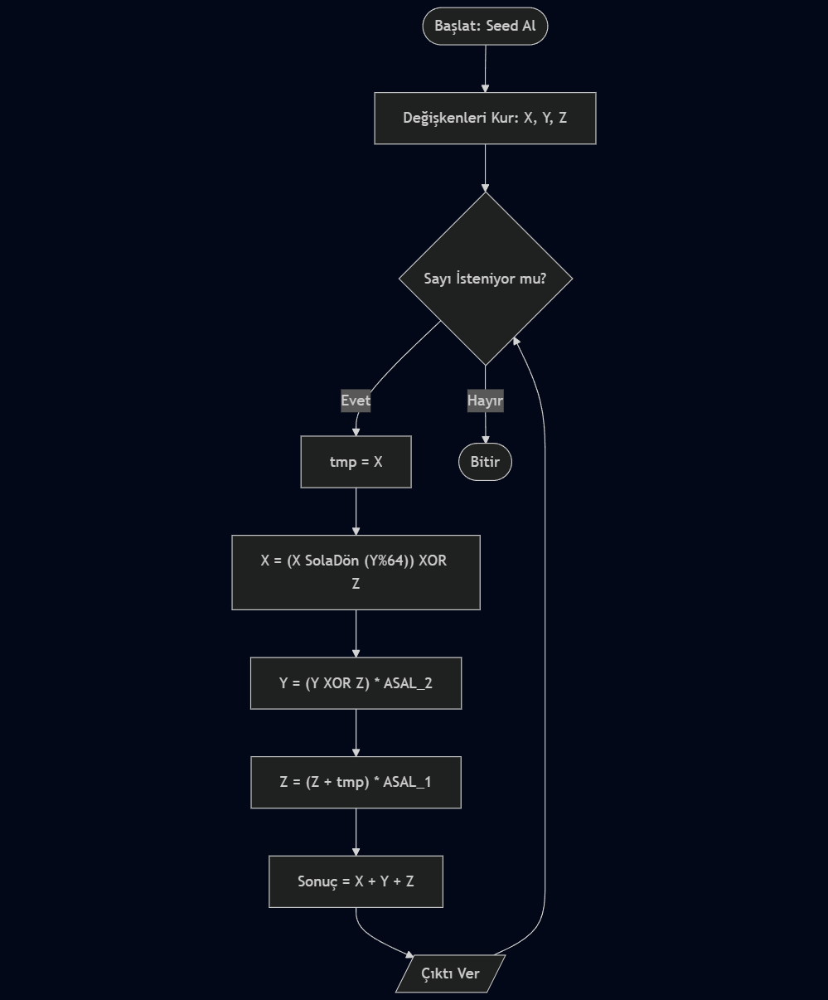

# Kaotik Yörünge Kaydırma (COS) - Rastgele Sayı Üreteci
### (Chaotic Orbit Shift Random Number Generator)

Bu proje, **Bilgi Sistemleri Güvenliği** dersi kapsamında geliştirilmiş özgün bir Rastgele Sayı Üreteci (RSÜ) algoritmasıdır.

## 1. Algoritmanın Mantığı ve Çalışma Prensibi
Geliştirilen **COS (Chaotic Orbit Shift)** algoritması, doğrusal olmayan dinamik sistemlerden ve kaos teorisinden esinlenmiştir. Standart algoritmaların (örneğin LCG) aksine, bu algoritma tahmin edilebilirliği zorlaştırmak için üç farklı "yörünge" değişkeni ($X, Y, Z$) kullanır.

Algoritmanın temel yenilikleri şunlardır:
* **Dinamik Bit Kaydırma:** $X$ değişkeninin sola dönme (rotate) miktarı sabit değildir; o anki $Y$ değişkeninin değerine göre her adımda değişir (`Y mod 64`). Bu, periyodik tekrarları engeller.
* **Çapraz Bağımlılık (Cross-Dependency):** Değişkenler birbirini *XOR, Toplama ve Çarpma* gibi farklı matematiksel işlemlerle etkiler. $X$ değişkeni $Z$'den, $Y$ değişkeni $X$'ten etkilenir.
* **Kaotik Sabitler:** Altın Oran ($\phi$) ve diğer irrasyonel sayılardan türetilmiş 64-bitlik büyük asal sabitler kullanılarak sayı uzayına homojen dağılım sağlanır.

## 2. Sözde Kod (Pseudocode)
Algoritmanın adım adım işleyişi aşağıdaki gibidir:

```text
BAŞLAT
    GİRDİ: tohum (seed)
    SABİTLER: 
        ASAL_1 = 0x9E3779B97F4A7C15
        ASAL_2 = 0xBF58476D1CE4E5B9
    
    // Durum değişkenlerini ilklendir (Seed Mixing)
    X = tohum
    Y = (tohum * ASAL_1)
    Z = (tohum XOR ASAL_2) + X

    FONKSİYON RastgeleSayiUret():
        gecici_x = X
        
        // ADIM 1: Dinamik Yörünge Kaydırma
        donme_miktari = Y MOD 64
        X = (X SOLA_DÖNDÜR donme_miktari) XOR Z
        
        // ADIM 2: Kaotik Çarpım ve Karıştırma
        Y = ((Y XOR Z) * ASAL_2)
        
        // ADIM 3: Geri Besleme (Feedback)
        Z = ((Z + gecici_x) * ASAL_1)
        
        // Sonucu Hesapla
        SONUÇ = (X + Y + Z)
        
        DÖNDÜR SONUÇ
    SON FONKSİYON
BİTİR

## 3. Akış Şeması (Flowchart)
Algoritmanın döngüsel yapısını gösteren şema aşağıdadır:



##  4. İstatistiksel Testler ve Güvenlik Analizi
Algoritmanın ürettiği sayıların rastgeleliğini doğrulamak için main.py dosyası içerisinde aşağıdaki testler otomatik olarak yapılmaktadır:

Bit Dağılımı Testi (0-1 Eşitliği):
Üretilen sayılardaki bitlerin %50'sinin "0", %50'sinin "1" olması hedeflenir.
Başarım Kriteri: Oranın %49.9 - %50.1 aralığında olması.

Shannon Entropisi:
Bilgi düzensizliğini ölçer. 8-bitlik örnekleme için maksimum değer 8.0'dır.
Başarım Kriteri: 7.99 üzerinde bir değer, sayıların tahmin edilemez olduğunu gösterir.

Ki-Kare (Chi-Square) Testi:
Sayıların dağılımının "Uniform" (eşit) olup olmadığını ölçer.
Yorum: Değerin serbestlik derecesine yakın olması, dağılımın rastgele olduğunu kanıtlar.

## 5. Örnek Çalışma Çıktısı ve Kanıt
...başarıyla geçtiğini göstermektedir:


